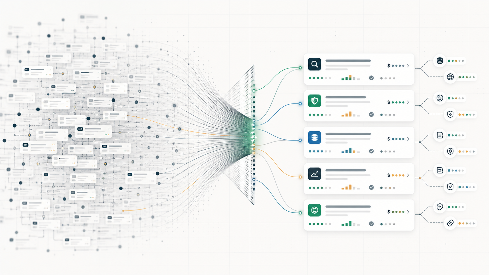

# RouteSignal

**A field guide to the long tail of paid API routes for agents.**

<p align="center">
  
</p>

<p align="center">
  <a href="https://routesignal.pages.dev"></a>
  
  
  
</p>

As paid API routes get cheaper and easier to publish, the interesting question stops being "can an agent pay an endpoint?" and becomes "what can an agent discover, compare, and compose when thousands of small paid capabilities are available by the call?"

RouteSignal is a static research artifact for that question. It compresses 13,517 public x402 route records into a map of what exists now, where the long tail is forming, which routes have observable activity or usable metadata, how prices cluster, and what Unix-like compositions become possible when paid APIs behave like small command-line ingredients.

[Live demo](https://routesignal.pages.dev) · [Data dictionary](docs/data-dictionary.md) · [Methodology](docs/methodology.md) · [Limitations](docs/limitations.md)

## The Pitch

If agent payments work, the future is not one giant API marketplace. It is a huge long tail of tiny paid routes: sanctions checks, wallet forensics, shipping calculators, social actions, registry lookups, storage receipts, search probes, local data, risk screens, and strange niche tools that are not worth subscribing to but are worth buying once.

That creates a new problem: agents and builders need a way to understand the route universe.

RouteSignal is the early map:

- **What exists?** A canonical database of listed x402 paid routes.
- **What has evidence?** Observable activity, metadata completeness, price clarity, freshness, and source links.
- **Where is the long tail?** Capability clusters, route farms, weird niches, and provider concentration.
- **What can be composed?** Spend-plan recipes that chain small paid calls into useful workflows.
- **What should not be overclaimed?** Clear limits around listing data, endpoint quality, safety, and legal/compliance risk.

The mental model is closer to Unix pipes than SaaS subscriptions: each route is a small paid capability, and the interesting product surface is the composition layer.

## Why This Exists

A raw endpoint directory is not enough. Builders need to know:

| Question | RouteSignal surface |
| --- | --- |
| What paid routes are listed? | RoutesDB canonical route records. |
| Which routes have observable demand signal? | Activity buckets, transaction counts, buyer counts, and volume where visible. |
| Which listings are machine-readable enough for agents? | Metadata completeness scoring. |
| Where does the long tail cluster? | Analyzer capability map, price ladder, and route density. |
| Which providers distort market size? | Provider shape and route-farm compression. |
| What could agents compose? | Wizard spend-plan hypotheses grounded in route ingredients. |

## Product

RouteSignal has exactly three pages.

### 1. RoutesDB

The canonical evidence browser. It exposes route-level records with stable IDs, provider, cost, category, activity signal, metadata completeness, price band, risk flags, and source links.

Primary indicators are observable:

- activity signal
- metadata completeness
- price clarity
- freshness
- evidence link

### 2. Analyzer

The market-compression cockpit. It shows evidence stages, provider concentration, route-count distortion, signal-map clustering, cost distribution, network distribution, surprising route collections, and trust notes.

### 3. Wizard

The demo layer. It turns route ingredients into long-tail spend-plan hypotheses with task, budget, first-dollar call, route chain, stop rule, receipt trail, and failure modes.

## Data Files

Canonical public data lives in `site/public/data/`.

| File | Purpose |
| --- | --- |
| `routesdb.json` | Enriched canonical route database. |
| `routesdb.jsonl` | Agent-friendly line-delimited route records. |
| `routesdb.csv` | Spreadsheet-ready route database. |
| `route-insights.json` | Analyzer clusters, provider shapes, warnings, and bundles. |
| `cross-pollination-recipes.json` | Wizard hypotheses and spend plans. |
| `api-routes.json` | Raw normalized route records from x402scan. |
| `api-routes.csv` | CSV version of raw normalized route records. |

## Quick Start

```bash
git clone https://github.com/greenforestpath/routesignal.git
cd routesignal
npm install
npm run dev
```

For a plain local static preview:

```bash
npm run preview
```

Then open `http://127.0.0.1:8795`.

## Regenerate Data

Refresh the public x402scan route capture and rebuild derived RouteSignal data:

```bash
npm run refresh
```

Re-run only the local analysis step:

```bash
npm run analyze
```

## Deploy

```bash
npm run deploy
```

The Cloudflare Pages project name is `routesignal`.

## Architecture

```text
x402scan public route records
        |
        v
scripts/extract-api-routes.mjs
        |
        v
site/public/data/api-routes.{json,csv}
        |
        v
scripts/analyze-api-routes.mjs
        |
        +--> site/public/data/routesdb.{json,jsonl,csv}
        +--> site/public/data/route-insights.json
        |
        v
static RouteSignal site
```

## What It Does Not Claim

RouteSignal is honest about the evidence boundary:

- listed payable route is not endpoint-quality proof
- provider-level activity is not always endpoint-level demand
- no route is guaranteed safe, legal, useful, or currently callable
- activity and metadata are signals, not truth

See [Limitations](docs/limitations.md).

## Repository Layout

```text
site/public/             static website
site/public/data/        public derived data
scripts/                 extraction and analysis scripts
sources/x402scan/        selected source captures used for activity joins
docs/                    methodology, data dictionary, limitations
research/                selected research notes
```

## License

MIT
