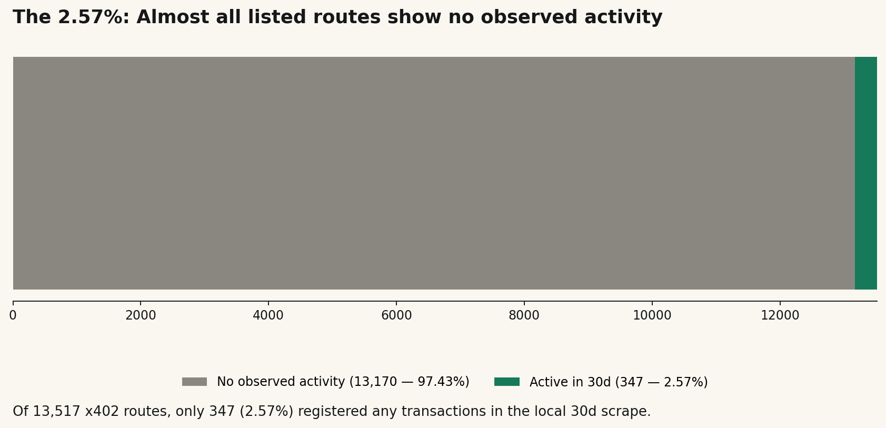
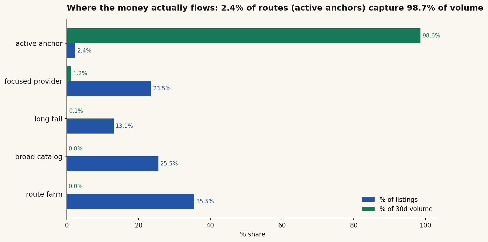
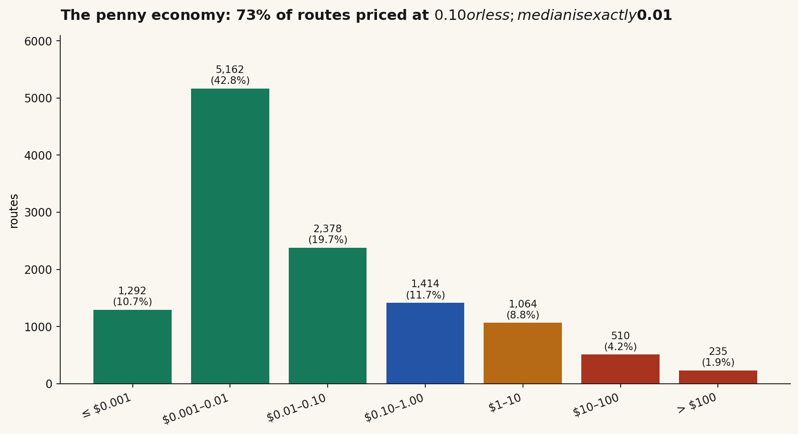
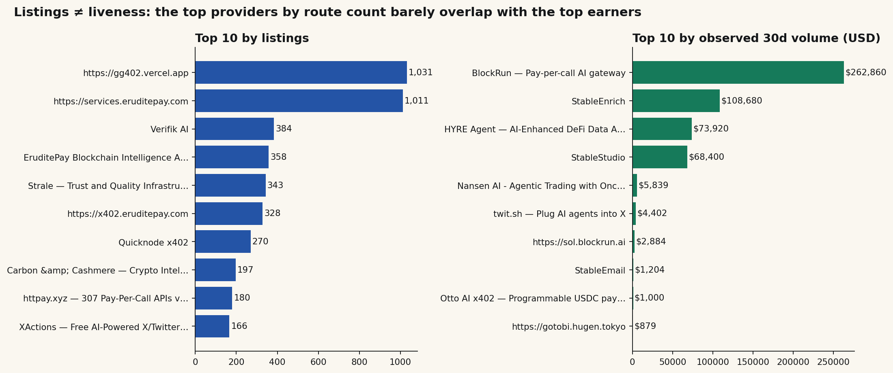
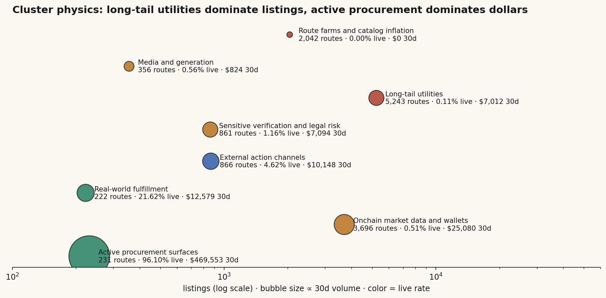
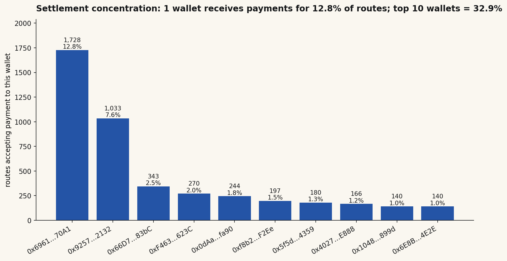
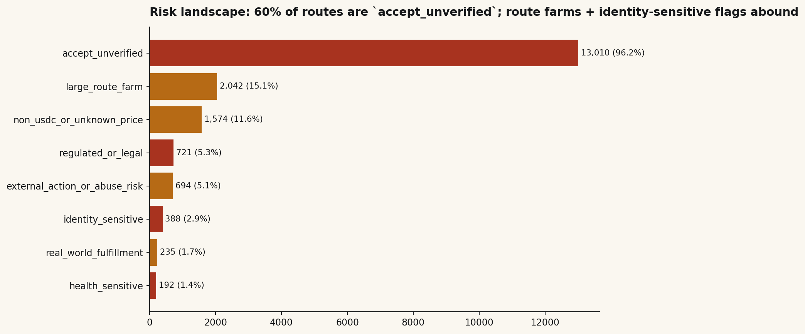

# RouteSignal — Top Insights Brief

*Source: `site/public/data/routesdb.csv` · n = 13,517 route records · 1,753 providers · 6 networks · scrape snapshot 2025-11*

---

## TL;DR — the seven things that actually matter

| # | Insight | Headline number |
|---|---|---|
| 1 | **Listings ≠ liveness.** The x402 catalog is mostly inventory, not commerce. | **97.43%** of routes had **zero** observed transactions in 30d |
| 2 | **Volume is hyper-concentrated.** A tiny slice of "active anchor" providers eats almost all the dollars. | **2.4%** of routes (active anchors) = **98.7%** of observed 30d volume |
| 3 | **Catalog inflation is endemic.** Two provider shapes — *route farm* + *broad catalog* — together produce **61%** of all listings with **$0** observed revenue. | **8,254** zombie routes |
| 4 | **The economy runs on pennies.** Median listed price is exactly **$0.01 USDC**; 73% of routes price at ≤$0.10. | TX-weighted mean spend: **$0.20** |
| 5 | **Settlement is concentrated.** A single wallet receives payments for **1,728** routes (12.8%); top 10 wallets = **32.9%**. | 1 wallet → 12.8% of catalog |
| 6 | **Base mainnet owns 89%** of all routes. Solana is the only meaningful second network at ~9%. | 12,043 of 13,517 |
| 7 | **The verification gap is real.** **60%** of routes carry `accept_unverified` risk; 1,879 also flagged as `large_route_farm`. | 8,087 unverified routes |

---

## 1 · The 2.57% — almost everything is silent

Of 13,517 listed routes, **only 347 (2.57%)** registered any transactions in the 30-day local scrape window. This is the central fact of the dataset and the reason RouteSignal exists: the directory is not the market.

- Total observed txns (30d): **15.83M**
- Total observed volume (30d): **$532,290**
- Distinct buyers observed: **104,071**

The catalog has 39× more dead listings than live ones. Agents browsing x402 raw will spend 39 calls on noise for every 1 useful endpoint they hit by chance.

---

## 2 · Provider shape paradox — anchors vs. farms

RouteSignal classifies providers into five shapes. The volume share is a wrecking ball:

| Shape | Listings | % of listings | 30d volume | % of volume | Live rate |
|---|---:|---:|---:|---:|---:|
| active anchor | 321 | 2.4% | $525,102 | **98.7%** | 91.9% |
| focused provider | 3,178 | 23.5% | $6,606 | 1.2% | 1.6% |
| long tail | 1,764 | 13.0% | $584 | 0.1% | 0.06% |
| broad catalog | 3,449 | 25.5% | $0 | 0% | **0%** |
| route farm | 4,805 | 35.5% | $0 | 0% | **0%** |

**Implication:** ranking routes by signal/quality instead of listing count is not a nice-to-have. It's the only way to make the directory usable.

---

## 3 · The penny economy

| Bucket | Routes | Share |
|---|---:|---:|
| ≤ $0.001 | 1,232 | 10.2% |
| $0.001 – $0.01 | 5,222 | 43.3% |
| $0.01 – $0.10 | 2,378 | 19.7% |
| $0.10 – $1.00 | 1,414 | 11.7% |
| $1 – $10 | 780 | 6.5% |
| $10 – $100 | 771 | 6.4% |
| > $100 | 258 | 2.1% |

- **Median listed price:** exactly **$0.01 USDC**
- **Modal cost string:** `0.01 USDC` — 3,448 routes (25.5%) cluster on a single price point
- **Transaction-weighted mean** (what buyers actually paid): **$0.196**
- **Max listed price:** $1,000,000,000,000 (dirty data — a `10000 atomic units token` parse failure)

This is per-call commerce, not subscription. The Unix-pipes thesis is supported by the price distribution itself.

---

## 4 · Listings ≠ earners — the two leaderboards barely overlap

The top 10 providers by listing count are dominated by route farms (`gg402.vercel.app` — 1,031 routes, $0 revenue). The top 10 by revenue is a completely different list led by **BlockRun** ($262,860 / 30d on 78 routes) and **StableEnrich** ($108,680 on 38 routes).

Just **two providers** — BlockRun + StableEnrich — together generated **~$371k of $532k = 70%** of all observed 30d volume.

---

## 5 · Cluster physics — where listings live vs. where dollars live

| Cluster | Listings | Live rate | 30d volume | $/listing |
|---|---:|---:|---:|---:|
| Active procurement surfaces | 231 | high | $469,553 | **$2,033** |
| Onchain market data & wallets | 3,696 | mixed | $25,098 | $6.79 |
| Real-world fulfillment | 222 | low | $12,577 | $56.66 |
| External action channels | 866 | low | $10,150 | $11.72 |
| Sensitive verification | 861 | low | $7,094 | $8.24 |
| Long-tail utilities | 5,243 | ~0% | $7,025 | $1.34 |
| Media & generation | 356 | low | $826 | $2.32 |
| Route farms & catalog inflation | 2,042 | 0% | $0 | $0 |

"Long-tail utilities" wins the listing count contest (5,243) but barely registers in dollars. "Active procurement surfaces" has 23× fewer listings but 67× the volume.

---

## 6 · Settlement is a few wallets, not many

- **1,375** distinct payment-receiving wallets across 13,517 routes
- **Top 1 wallet** (`0x6961…70A1`) receives payments for **1,728 routes — 12.8%** of the entire catalog
- **Top 10 wallets** = **32.9%** of routes

This is hidden provider consolidation. The "1,753 providers" headline overstates true publisher diversity by roughly **5–8×** once you trace settlement endpoints.

---

## 7 · Risk landscape — what the verdicts are protecting against

| Risk flag | Routes |
|---|---:|
| `accept_unverified` | 8,087 |
| `+ large_route_farm` | 1,879 |
| `+ non_usdc_or_unknown_price` | 1,159 |
| `+ external_action_or_abuse_risk` | 506 |
| `+ identity_sensitive` `+ regulated_or_legal` | 249 |
| `+ regulated_or_legal` | 232 |
| `+ real_world_fulfillment` | 204 |
| `+ health_sensitive` | 94 |

RouteSignal's PAY / PROBE / WARN / BLOCK verdicts:

| Verdict | Routes |
|---|---:|
| PAY | 6,259 |
| PROBE | 5,749 |
| WARN | 815 |
| BLOCK | 694 |

**11% of the catalog is non-clean.** Without this layer, agents touch identity-sensitive, regulated, or abuse-risk endpoints by default.

---

## Bonus — surprising long-tail niches that actually exist

Per-call paid endpoints in the data for things normally locked behind subscriptions:

- **sanctions screening** — 55 routes
- **KYC** — 29 routes
- **wallet forensics / labeling** — 489 routes
- **phone number provisioning** — 71 routes
- **language translation** — 34 routes
- **recipe / cooking** — 100 routes
- **weather** — 76 routes
- **memes** — 62 routes
- **dream interpretation** — 20 routes
- **tarot / horoscope / astrology** — 15 routes combined
- **poker tools** — 11 routes
- **DNA analysis** — 7 routes
- **dating utilities** — 7 routes

This is the proof of the "Unix command-line ingredients" thesis. Some of these have ~5 buyers and pull in cents per month — and that is exactly the point of per-call paid APIs.

---

## What this means for the pitch

1. **Lead with the 97.43% / 2.57% split.** It is the most legible single statistic in the dataset.
2. **Frame the product around the asymmetry**, not the headline count. "13,517 routes" sounds big; "98.7% of dollars in 2.4% of routes" sounds like a problem RouteSignal solves.
3. **Show one concrete dead-vs-live example per cluster** so the audience feels the noise.
4. **Use the wallet-concentration finding** — it is non-obvious and earns credibility.
5. **The verdict layer (PAY/PROBE/WARN/BLOCK) is the product** — verified by the 11% non-clean share.
